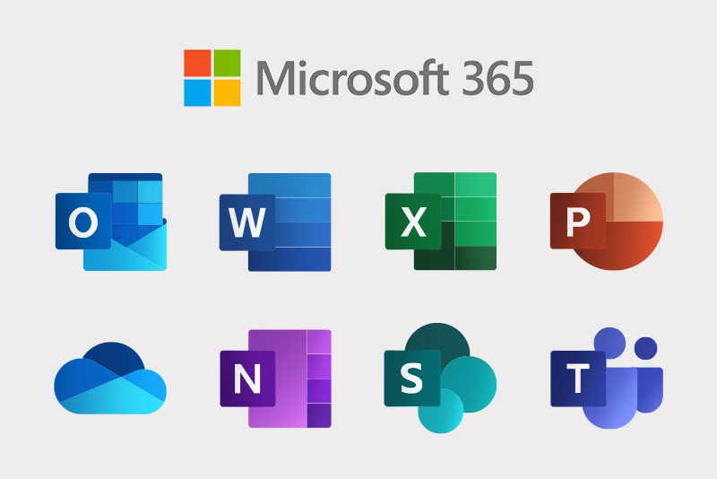
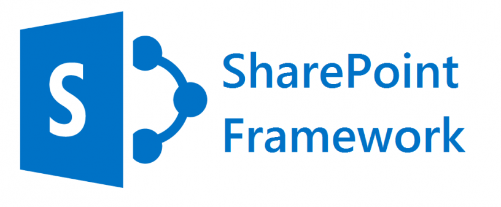

J'ai réalisé mon alternance chez Blizz. C'est une entreprise qui propose des services informatique comme l'hébergement de données ou le développement de projet informatique.
Blizz fais partie du groupe Odehus et se situe a Cournon d'Auvergne.

Le sujet de mon alternance consiste en la création de l’intranet de l'entreprise.
Le but de l’intranet est de fournir des outils aux salariés qui facilitera la communication, la collaboration et le partage des ressources. L’intranet facilite certaines tâches de l’employé et donc l’aide à accroître son efficacité opérationnelle.

On m'a demandé de réaliser trois application : 

* Un trombinoscope
* Un gestionnaire de ressource
* Un gestionnaire de congés

Ces applications devaient toutes être intégrées dans l'environnement Microsoft 365.

Par exemple, ces applications devaient être accessibles pour les employés via Teams ou SharePoint. Certaines applications devaient également pouvoir envoyer des notifications Teams, interagir avec le calendrier Outlook, stocker des informations dans SharePoint ou même récupérer des informations dans Azure Active Directory.

    
    

### Trombinoscope 

Le trombinoscope affiche la hiérarchie organisationnelle avec les photos, noms, prénoms et fonctions des employés de Odehus. Grâce à son intégration avec Azure Active Directory (AD), un service de gestion des identités et des accès, le trombinoscope est toujours à jour, reflétant automatiquement toute modification. La notion de hiérarchie déjà présente dans AD m'a permis de construire le trombinoscope de manière efficace et structurée.

### Gestionnaire de ressource

Une application qui permet au employé via un calendrier de réserver une voiture ou une salle de réunion

### Gestionnaire de congés

Permet au employé de prendre des congés, consulté leurs solde et déclarer des heures supplémentaires. 