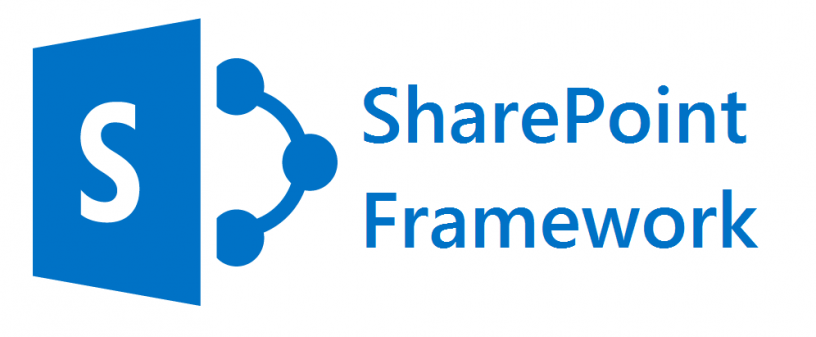

I completed my apprenticeship at Blizz, a company that offers IT services such as data hosting and software development. Blizz is part of the Odehus group and is located in Cournon d'Auvergne.

The focus of my apprenticeship was the creation of the company's intranet. The intranet aims to provide tools to employees that facilitate communication, collaboration, and resource sharing, thereby enhancing operational efficiency.

I was tasked with developing three applications:

* A photo directory
* A resource manager
* A leave manager

All these applications had to be integrated into the Microsoft 365 environment.

For instance, these applications needed to be accessible to employees through Teams or SharePoint. Some applications also had functionalities like sending Teams notifications, interacting with Outlook calendars, storing information in SharePoint, or retrieving data from Azure Active Directory.

    
    

### Photo Directory

The photo directory displays the organizational hierarchy with photos, names, first names, and job roles of Odehus employees. Thanks to its integration with Azure Active Directory (AD), a service for identity and access management, the directory is always up-to-date, automatically reflecting any changes. Leveraging the hierarchy already present in AD enabled me to build the directory efficiently and in a structured manner.

### Resource Manager

An application that allows employees to reserve a car or meeting room via a calendar interface.

### Leave Manager

Allows employees to request time off, check their leave balances, and declare overtime hours.

