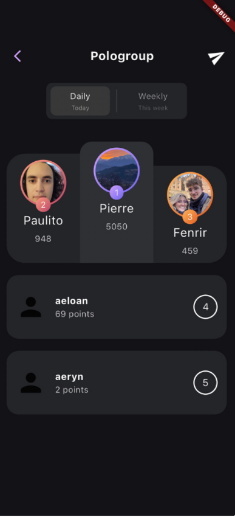

J'ai réaliser en troisième année de BUT informatique avec 4 autres de mes camarades un jeu mobile multiplateforme qu'on a nommé "Rivall".

## But du jeu

Notre application est un mix entre un jeu et un réseau social. En effet les utilisateurs peuvent s'ajouter en amis, modifier leur profil et communiquer entre eux via une messagerie.
Afin de débuter une partie un groupe doit être créé. A ce moment la les personnes du groupe reçoive des quêtes. Le but est de réaliser le plus de quêtes possible et le plus rapidement possible.

Après validation de la quête par les membres du groupe le joueur reçoit des points et peu consulter le classement du groupe.

<!--  -->
## Ma contribution

Dans ce projet, j'ai mis en place une API REST avec `Django Rest Framework`. Cela m'a permis de configurer les mécanismes d'inscription et d'authentification pour notre application mobile. Plus tard, j'ai ajouté une couche pour gérer le protocole WebSocket, ce qui m'a permis d'implémenter la messagerie instantanée dans notre application.